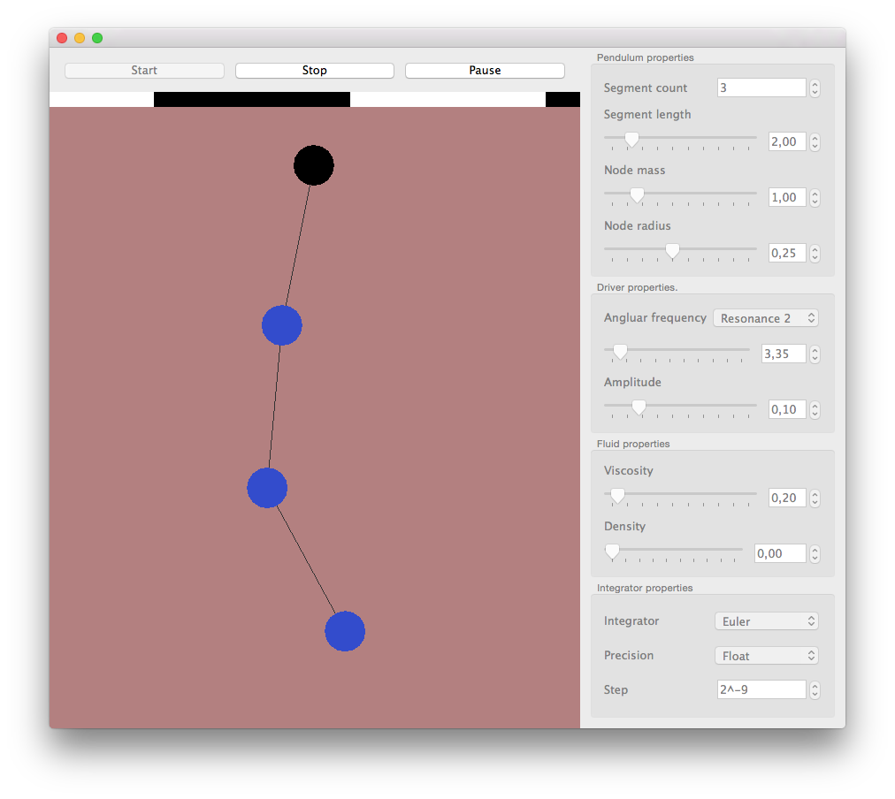

Pendulum
========

This project was made during the Modelling of Natural Problems course held at the University
of Wrocław in 2011/2012. It applies numerical ODE solving methods to the model of multipart
pendulum.

Model
-----

The pendulum model is simplified and faithful only with small deflections. Despite the
visualization, the nodes are assumed to maintain their vertical position at all times.

Parameters
----------

**Pendulum properties** specify the number of segments, the length of a single segment, the mass
ans the size of a node.

**Driver properties** allow to setup a driver for the anchor node. The first node can be set to
oscillate with a given frequency and amplitude. For pendulums of at most 9 segments, predefined
resonance frequencies are available.

**Fluid properties.** One can modify the parameters of the medium the pendulum is submerged in.
A non-damping environment almost always results in an eventually unstable simulation.

**Integrator properties** specify the integrator. Two integration methods are provided with
the application: a naive Euler integrator and an RK4 integrator. But other implementations may
be added by extending the Integrator class. The user can specify wether the computation is to be
performed using float or double precision. The step size can also be set.

Technical
---------

Last time I tried, the project was compiled usint Qt 5 tools, but older versions should also be
working.

The application makes use of multithreading to separate the integration from the visualization.
